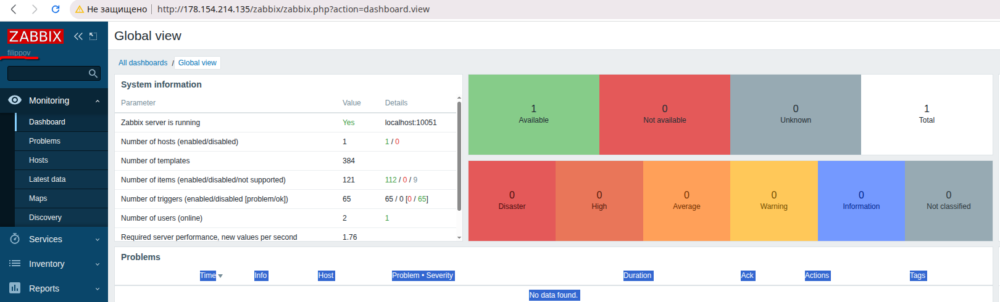
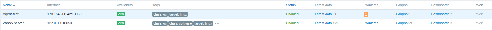
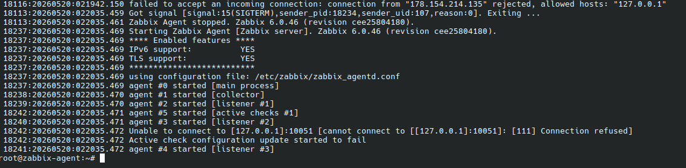
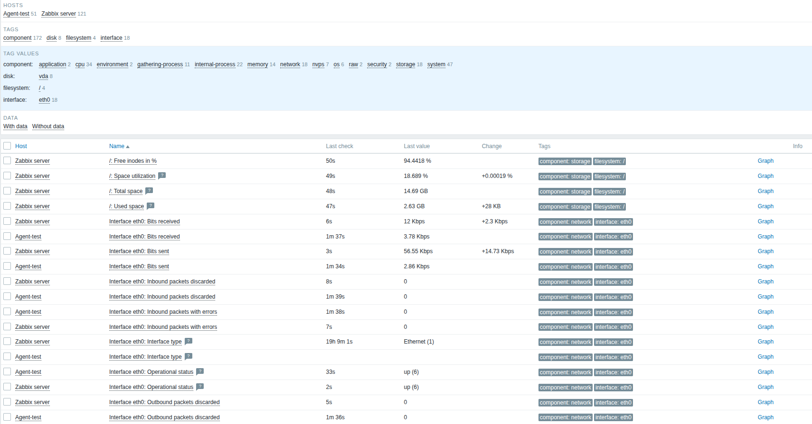

# Домашнее задание к занятию "Система мониторинга Zabbix" - `Филиппов Константин`

---

### Задание 1

```
sudo -i
wget https://repo.zabbix.com/zabbix/6.0/debian/pool/main/z/zabbix-release/zabbix-release_latest_6.0+debian11_all.deb
dpkg -i zabbix-release_latest_6.0+debian11_all.deb
apt update
apt upgrade
apt install zabbix-server-pgsql zabbix-frontend-php php7.4-pgsql zabbix-apache-conf zabbix-sql-scripts zabbix-agent
sudo -u postgres createuser --pwprompt zabbix
sudo -u postgres createdb -O zabbix zabbix
zcat /usr/share/zabbix-sql-scripts/postgresql/server.sql.gz | sudo -u zabbix psql zabbix
nano /etc/zabbix/zabbix_server.conf
systemctl restart zabbix-server zabbix-agent apache2
systemctl enable zabbix-server zabbix-agent apache2
```





---

### Задание 2

```
sudo -i
wget https://repo.zabbix.com/zabbix/6.0/debian/pool/main/z/zabbix-release/zabbix-release_latest_6.0+debian11_all.deb
dpkg -i zabbix-release_latest_6.0+debian11_all.deb
apt update
apt upgrade
apt install zabbix-agent
systemctl restart zabbix-agent
systemctl enable zabbix-agent
nano /etc/zabbix/zabbix_agentd.conf
tail -f /var/log/zabbix/zabbix_agentd.log
systemctl restart zabbix-agent.service
systemctl status zabbix-agent.service
```






---


